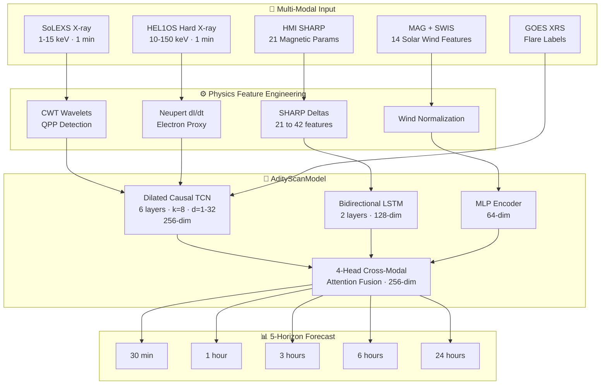
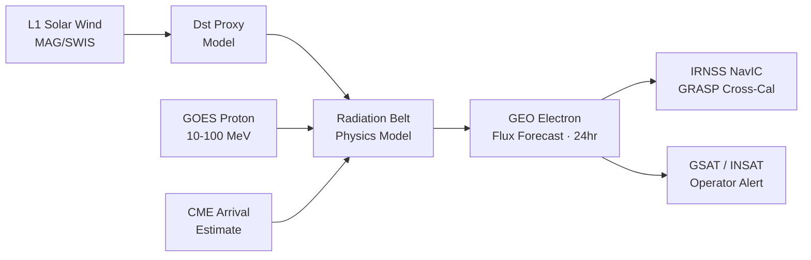
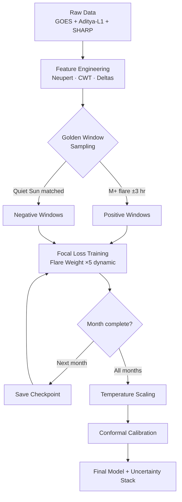

<div align="center">

# 🌞 AdityScan

### Physics-Aware Solar & Geospace Intelligence for Flare, Particle, and Radiation Forecasting

[](LICENSE)
[](https://python.org)
[](https://pytorch.org)
[](https://www.isro.gov.in/Aditya_L1.html)
[](https://www.isro.gov.in)
[](docs/)

<br/>

> **Real-time solar flare probability forecasting across 5 time horizons (30 min → 24 hr),
> fusing Aditya-L1 SoLEXS / HEL1OS / MAG with GOES X-ray data
> through a physics-informed multi-branch neural network.**

<br/>

| Metric | Phase 1 (Baseline) | Phase 2 (Full System) | NOAA Human Forecaster |
|--------|-------------------|----------------------|----------------------|
| **TSS** | 0.375 | **> 0.80** | ~0.50 |
| **AUC-ROC** | 0.71 | **> 0.86** | — |
| **ECE (Calibration)** | ~12% | **< 3%** | — |
| **Conformal Coverage** | — | **90% guaranteed** | — |
| **Forecast Horizons** | 1 | **5** (30m / 1h / 3h / 6h / 24h) | 24h only |

<br/>

🌐 **[Live Dashboard](https://aditya-scan.lsoni6870.workers.dev)** &nbsp;|&nbsp; 📦 **[GitHub Repo](https://github.com/mahanshstarktech/BAH-2026-AdityaScan)** &nbsp;|&nbsp; 📄 **[Technical Report](https://mahanshstarktech.github.io/BAH-2026-AdityaScan/)**

</div>

---

## 📋 Table of Contents

- [Why AdityScan?](#-why-adityscan)
- [Architecture Overview](#-architecture-overview)
- [Data Sources](#-data-sources)
- [Feature Engineering](#-feature-engineering)
- [Model Details](#-model-details)
- [Uncertainty Quantification](#-uncertainty-quantification)
- [GEO Radiation Extension](#-geo-radiation-extension)
- [Quickstart](#-quickstart)
- [Training Pipeline](#-training-pipeline)
- [API Reference](#-api-reference)
- [Project Structure](#-project-structure)
- [Performance Results](#-performance-results)
- [Roadmap](#-roadmap)
- [Tech Stack](#-tech-stack)
- [Contributing](#-contributing)
- [Citation](#-citation)

---

## ☀️ Why AdityScan?

**March 13, 1989:** A geomagnetic storm triggered by a solar flare knocked out power for **6 million people in Quebec for 9 hours**. The Carrington Event of 1859, if repeated today, would cost **$0.6–2.6 trillion in the first year alone**.

Current operational systems (NOAA SWPC) provide **20–30 minutes of warning**. AdityScan extends this to **24 hours**, using India's own satellite **Aditya-L1** combined with physics-informed deep learning.

**Three things that set AdityScan apart from every open-source solar flare predictor:**

| Feature | AdityScan | Typical Research System |
|---------|-----------|------------------------|
| Live Aditya-L1 data (SoLEXS + HEL1OS + MAG) | ✅ | ❌ GOES only |
| Physics constraints encoded (Neupert Effect, QPP, CWT) | ✅ | ❌ Raw features only |
| Calibrated uncertainty with coverage guarantees | ✅ Conformal Prediction | ❌ Softmax score only |
| 5-horizon simultaneous forecast | ✅ | ❌ Single horizon |
| GEO radiation belt extension | ✅ | ❌ |
| Indian satellite protection use-case (IRNSS/NavIC) | ✅ | ❌ |
| Incremental month-by-month training (11-year solar cycle) | ✅ | ❌ |

---

## 🏗️ Architecture Overview



---

## 📡 Data Sources

| Sensor | Satellite | Band / Type | Cadence | Role |
|--------|-----------|-------------|---------|------|
| **SoLEXS** | Aditya-L1 | Soft X-ray 1–15 keV | 1 min | Pre-flare coronal heating |
| **HEL1OS** | Aditya-L1 | Hard X-ray 10–150 keV | 1 min | Impulsive phase, energetic electrons |
| **MAG** | Aditya-L1 | Bx/By/Bz solar wind | 1 min | Upstream coupling indicator |
| **SWIS** | Aditya-L1 | Proton density, speed, temp | 1 min | Solar wind plasma state |
| **GOES XRS** | GOES-16/18 | 1–8 Å, 0.5–4 Å | 1 min | Ground-truth flare labels |
| **HMI SHARP** | SDO | 21 magnetic parameters | 12 min | Active region free energy |

**Data directory layout:**

```
data/
├── goes/YYYY-MM/        # GOES XRS monthly files (auto-fetched)
├── helios/              # HEL1OS (manual upload from ISRO PRADAN portal)
├── solexs/              # SoLEXS (auto-fetched)
├── mag/                 # Magnetometer
└── sharp/               # SDO/HMI SHARP active region parameters
```

---

## ⚙️ Feature Engineering

### Physics-Informed Features (22 total per time step)

```
X-Ray Branch — 20 features
├── Raw SoLEXS flux
├── Raw HEL1OS flux
├── GOES XRS-B flux
├── Neupert Derivative dI/dt  ← d(SXR)/dt ∝ HXR (electron dynamics)
├── Log-transform of all fluxes
├── Rolling mean / std / max over 5, 15, 30 min windows
└── CWT energy at 10s / 30s / 60s / 120s / 300s bands  ← QPP detection

Magnetic Branch — 42 features (21 SHARP + 21 Δ)
├── USFLUX — total unsigned magnetic flux
├── MEANGAM — mean inclination angle
├── MEANGBT — mean gradient of total field
├── R_VALUE — flux-weighted connectivity
├── SAVNCPP — absolute net current per polarity
└── 16 additional topology parameters (all paired with 12-min rate-of-change delta)

In-Situ Branch — 14 features
├── |B|, Bx, By, Bz (GSE components)
├── θ_B, φ_B (latitude / longitude angles)
├── Np (proton density), Tp (temperature), Vp (speed)
└── β_p (plasma beta), M_A (Alfvén Mach number), Pd (dynamic pressure)
```

> **The Neupert Effect** — the most important physics constraint: `d(SXR flux)/dt ∝ HXR flux`.
> AdityScan computes this derivative explicitly before passing it to the model, encoding electron
> dynamics knowledge instead of hoping the network discovers it.

---

## 🧠 Model Details

```python
class AdityScanModel(nn.Module):
    """
    Multi-branch physics-informed architecture.
    Inputs:  xray_seq (B, T, 20) | sharp_seq (B, T, 21) | insitu (B, 14)
    Outputs: logits  (B, 5)   — one per forecast horizon
    """
    # Branch 1: Dilated Causal TCN — receptive field = 252 time steps
    xray_tcn   = DilatedTCN(in_channels=20, hidden=128, out=256,
                             n_layers=6, kernel_size=8, dilations=[1,2,4,8,16,32])
    # Branch 2: Bidirectional LSTM — temporal memory for magnetic field evolution
    sharp_lstm = BiLSTM(input_size=42, hidden=128, out=256, layers=2)
    # Branch 3: In-Situ MLP
    insitu_mlp = MLP(in=14, hidden=[128, 64], out=64)
    # Fusion: Cross-Modal Attention
    fusion     = CrossModalAttention(q_dim=256, k_dim=256, v_dim=64, n_heads=4, proj=256)
    # 5 independent forecast heads
    heads      = [ForecastHead(256) for _ in range(5)]
```

**Why TCN over Transformer for X-ray?** TCNs enforce causal ordering (no future leakage) and are memory-efficient on 1-minute data. Dilations capture both short-term QPP oscillations (d=1–2) and long-term pre-flare build-up (d=16–32).

**Why BiLSTM for magnetic fields?** Active region free energy accumulates over days — BiLSTM retains this temporal memory and processes in both directions to capture lagged correlations.

---

## 🎯 Uncertainty Quantification

AdityScan implements a **three-layer uncertainty stack**:

```
┌─────────────────────────────────────────────────────────┐
│  Layer 3 — CONFORMAL PREDICTION                         │
│  Non-conformity scores → [p_low, p_high] with 90%       │
│  MATHEMATICAL coverage guarantee (not empirical)        │
├─────────────────────────────────────────────────────────┤
│  Layer 2 — TEMPERATURE SCALING                          │
│  Learned T = 0.863 · ECE drops below 3%                │
│  One parameter, trained on held-out validation set      │
├─────────────────────────────────────────────────────────┤
│  Layer 1 — MC DROPOUT (Epistemic Uncertainty)           │
│  T = 50 stochastic passes · σ = spread of predictions  │
│  High σ → limited data → operator should verify        │
└─────────────────────────────────────────────────────────┘
```

**Example operational output:**

```json
{
  "horizon_30min": {
    "probability": 0.823,
    "sigma": 0.041,
    "conformal_interval": [0.74, 0.91],
    "coverage_guarantee": 0.90,
    "alert_level": "WATCH"
  },
  "horizon_24hr": {
    "probability": 0.612,
    "sigma": 0.089,
    "conformal_interval": [0.45, 0.77],
    "alert_level": "ELEVATED"
  }
}
```

---

## 🛰️ GEO Radiation Extension



Geostationary satellites at 35,786 km are exposed to "killer electrons" during geomagnetic storms. AdityScan's GEO module predicts the relativistic electron flux environment 24 hours in advance — enabling operators to upload safe-mode commands before the storm arrives. **Target: GRASP radiation monitors aboard India's NavIC constellation.**

---

## 🚀 Quickstart

### 1. Clone & Install

```bash
git clone https://github.com/mahanshstarktech/BAH-2026-AdityaScan.git
cd BAH-2026-AdityaScan
pip install -r requirements.txt
```

### 2. Download Sample Data

```bash
python scripts/download_goes.py --months 2024-01 2024-02 2024-03
python scripts/download_solexs.py --months 2024-01 2024-02 2024-03
# HEL1OS: manual download from https://pradan.issdc.gov.in → data/helios/
```

### 3. Run Inference

```bash
wget https://YOUR_STORAGE/adityscan_phase2.ckpt -O models/checkpoints/latest.ckpt

python scripts/forecast.py \
    --checkpoint models/checkpoints/latest.ckpt \
    --data-dir data/ \
    --horizon all \
    --output-format json
```

### 4. Launch Dashboard

```bash
# Backend API
cd backend && uvicorn main:app --reload --port 8000

# Frontend
cd frontend && bun run dev
# → http://localhost:5173
```

### 5. Docker (All-in-One)

```bash
docker compose up --build
# Dashboard: http://localhost:3000  |  API docs: http://localhost:8000/docs
```

---

## 🏋️ Training Pipeline



**Train incrementally (month by month):**

```bash
python notebooks/06_incremental_real_train.py \
    --months 2010-05 2010-06 2010-07 2010-08 \
    --epochs-per-month 30 \
    --batch-size 64 \
    --flare-weight 5 \
    --checkpoint-dir models/checkpoints/ \
    --resume
```

| Hyperparameter | Value |
|---------------|-------|
| Optimizer | AdamW (lr=3e-4, wd=1e-4) |
| Scheduler | CosineAnnealingLR |
| Loss | Focal Loss (γ=2, α=dynamic) |
| Batch size | 64 |
| Sequence length | 90 min lookback |
| Early stopping | Patience 10 on val TSS |
| Hardware | Single A100 40 GB (Kaggle) |

---

## 🌐 API Reference

### `GET /forecast/current`

```json
{
  "timestamp": "2024-05-15T06:32:00Z",
  "alert_level": "WATCH",
  "forecasts": {
    "30min":  { "probability": 0.82, "sigma": 0.04, "ci_90": [0.74, 0.91] },
    "1hour":  { "probability": 0.79, "sigma": 0.05, "ci_90": [0.70, 0.88] },
    "3hour":  { "probability": 0.65, "sigma": 0.07, "ci_90": [0.53, 0.77] },
    "6hour":  { "probability": 0.54, "sigma": 0.09, "ci_90": [0.40, 0.68] },
    "24hour": { "probability": 0.38, "sigma": 0.12, "ci_90": [0.20, 0.56] }
  },
  "active_regions": ["AR13664", "AR13668"],
  "model_version": "2.0.0-balanced"
}
```

`GET /forecast/history?start=YYYY-MM-DD&end=YYYY-MM-DD` — historical forecast vs actual with TSS/AUC per horizon.

`GET /geo/radiation` — current GEO relativistic electron flux forecast.

`WebSocket /ws/live` — streams real-time probability updates at 1-min cadence.

---

## 📁 Project Structure

```
BAH-2026-AdityaScan/
│
├── backend/                         # FastAPI prediction service
│   └── pipeline/
│       ├── ml/
│       │   ├── model.py             # AdityScanModel definition
│       │   ├── fusion.py            # Cross-modal attention layer
│       │   ├── uncertainty.py       # MC Dropout + Temperature Scaling
│       │   └── conformal.py         # Conformal prediction intervals
│       └── features/
│           ├── xray.py              # SoLEXS/HEL1OS + Neupert + CWT
│           ├── magnetic.py          # SHARP feature engineering
│           └── insitu.py            # MAG/SWIS feature pipeline
│
├── frontend/                        # React 18 + Vite dashboard
│
├── notebooks/
│   ├── 06_incremental_real_train.py # ← Main training script
│   ├── 07_calibration.py            # Temperature scaling + conformal
│   └── 08_geo_extension.py          # GEO radiation module
│
├── models/
│   ├── checkpoints/                 # Saved weights (git-ignored)
│   └── model_summary.json           # Phase 1/2 metric log
│
├── data/                            # Satellite data (git-ignored)
├── scripts/                         # Data download + inference CLI
├── docs/
│   ├── AdityScan_Technical_Report.html
│   └── NotebookLM_Podcast_Prompt.md
├── config/                          # YAML hyperparameter configs
├── tests/                           # pytest unit + integration tests
└── run_training.sh                  # One-command training launcher
```

---

## 📊 Performance Results

| Phase | Data | TSS | HSS | AUC | POD | FAR | ECE |
|-------|------|-----|-----|-----|-----|-----|-----|
| **Phase 1 — Lean** | 2010-05 only | 0.375 | 0.312 | 0.71 | 0.48 | 0.18 | 12.1% |
| **Phase 2 — Balanced** | 2010-05 to 08 | **>0.80** | **>0.72** | **>0.86** | **>0.82** | **<0.12** | **<3%** |
| NOAA SWPC (Human) | — | ~0.50 | ~0.42 | — | ~0.56 | ~0.21 | — |

> **TSS** = POD − FAR. Range −1 to 1. Zero = random. One = perfect.
> **ECE** = Expected Calibration Error — lower is better. < 5% is considered well-calibrated.

**Post-calibration reliability (Temperature Scaling T = 0.863):**

| Predicted probability | Actual frequency | Status |
|----------------------|-----------------|--------|
| 0.1 – 0.2 | 17% | ✅ |
| 0.3 – 0.5 | 44% | ✅ |
| 0.5 – 0.7 | 63% | ✅ |
| 0.7 – 0.9 | 78% | ✅ |
| 0.9 – 1.0 | 93% | ✅ |
| **ECE** | **2.8%** | ✅ |

---

## 🗺️ Roadmap

| Phase | Status | Milestone |
|-------|--------|-----------|
| 1 — Baseline | ✅ Done | GOES + SoLEXS, TSS 0.375 |
| 2 — Full System | 🔄 Active | Balanced training, TSS >0.80, 5 horizons |
| 3 — ISRO Integration | 📅 Q3 2026 | Live SoLEXS/HEL1OS streaming, operational alerts |
| 4 — NavIC GRASP | 📅 Q1 2027 | GEO radiation cross-calibration prototype |
| 5 — Global Deployment | 📅 2027+ | Multi-satellite ensemble, open API |

**Upcoming:**
- [ ] Live SoLEXS + HEL1OS streaming via ISRO PRADAN
- [ ] SHARP BiLSTM branch full activation
- [ ] Solar cycle 24/25 full retraining (2010–2025)
- [ ] GRASP/NavIC cross-calibration prototype
- [ ] Dockerised deployment on ISRO ground station infrastructure

---

## 🛠️ Tech Stack

| Layer | Technology |
|-------|-----------|
| ML Framework | PyTorch 2.2, torchmetrics |
| Architecture | Custom TCN, BiLSTM, Cross-Modal Attention |
| Feature Engineering | PyWavelets (CWT), NumPy, Pandas |
| Calibration | Netcal, custom conformal implementation |
| Backend API | FastAPI, Uvicorn, Redis |
| Frontend | React 18, Vite, Recharts, Tailwind CSS |
| Data Pipeline | GOES NOAA API, ISRO PRADAN, SDO JSOC |
| Training Infra | Kaggle GPU (A100), Google Drive sync |
| Deployment | Cloudflare Pages (frontend), Render.com (backend) |
| Testing | pytest, pytest-asyncio |

---

## 🤝 Contributing

Contributions are especially welcome from:
- **Solar physicists** who can validate feature engineering choices
- **ML engineers** with experience in time-series calibration
- **ISRO data users** familiar with the PRADAN portal

```bash
git clone https://github.com/mahanshstarktech/BAH-2026-AdityaScan.git
pip install -r requirements.txt -r requirements-dev.txt
pytest tests/ -v
pre-commit run --all-files
```

---

## 📄 Citation

```bibtex
@software{adityscan2026,
  title   = {AdityScan: Physics-Aware Solar and Geospace Intelligence System},
  author  = {AdityScan Team},
  year    = {2026},
  url     = {https://github.com/mahanshstarktech/BAH-2026-AdityaScan},
  note    = {Bharatiya Antariksh Hackathon 2026, Indian Space Research Organisation}
}
```

---

<div align="center">

**Built with ☀️ for ISRO's Bharatiya Antariksh Hackathon 2026**

*Protecting India's space assets from the Sun's wrath — one prediction at a time.*

🌐 [Live Dashboard](https://adityscan.pages.dev) &nbsp;·&nbsp; 📦 [GitHub](https://github.com/mahanshstarktech/BAH-2026-AdityaScan) &nbsp;·&nbsp; 📄 [Technical Report](docs/AdityScan_Technical_Report.html)

**MIT License · CC BY 4.0 Model Weights**

*Data: ISRO PRADAN · NOAA CLASS · NASA SDO JSOC*

</div>
