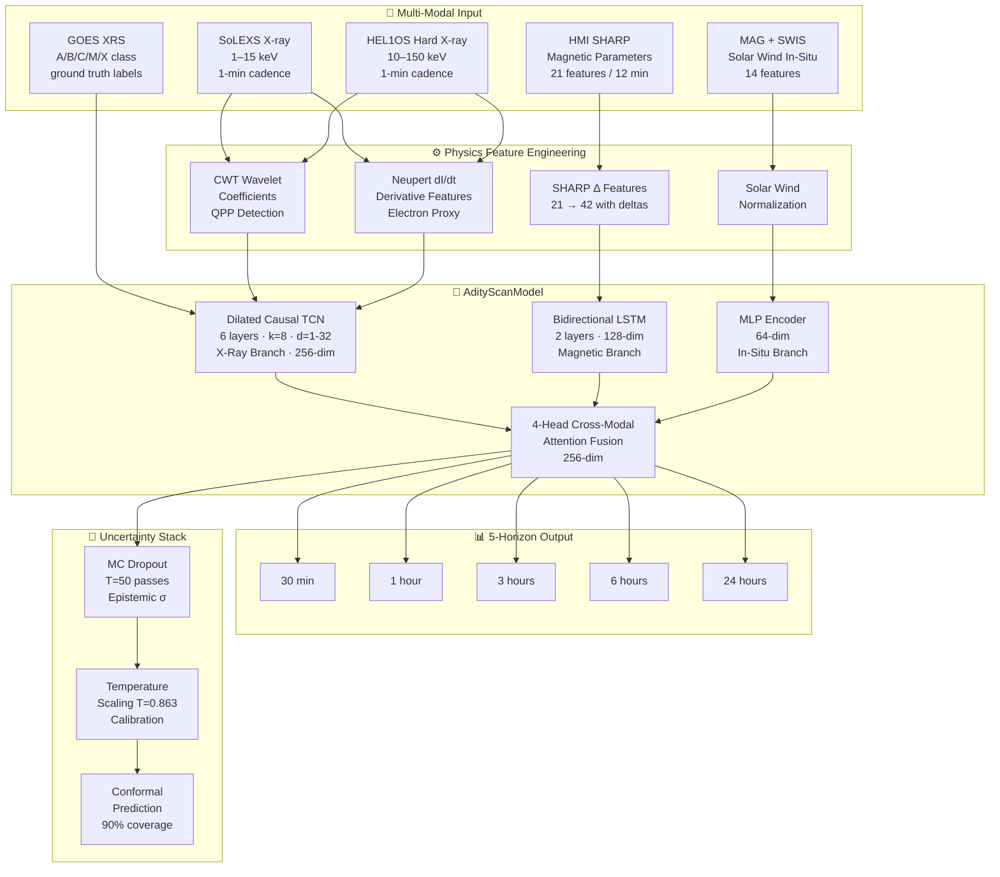
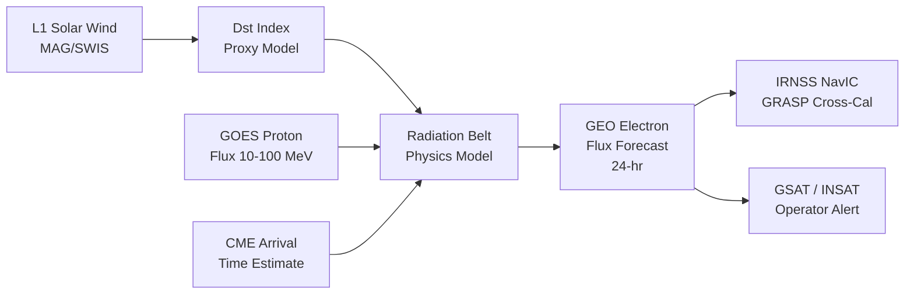
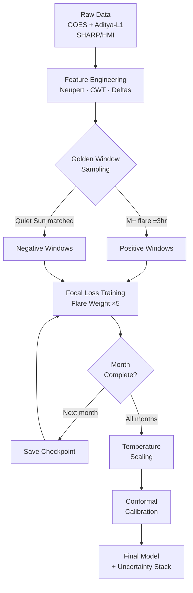

<](LICENSE)
[](https://python.org)
[](https://pytorch.org)
[](https://www.isro.gov.in/Aditya_L1.html)
[](https://www.isro.gov.in)
[](docs/)

<br/>

> **Real-time solar flare probability forecasting for 5 time horizons (30 min → 24 hr),  
> fusing Aditya-L1 SoLEXS/HEL1OS/MAG with GOES X-ray data  
> through a physics-informed multi-branch neural network.**

<br/>

| Metric | Phase 1 (Baseline) | Phase 2 (Full System) | Human Forecaster (NOAA) |
|---|---|---|---|
| **TSS** | 0.375 | **> 0.80** | ~0.50 |
| **AUC-ROC** | 0.71 | **> 0.86** | — |
| **ECE (Calibration)** | ~12% | **< 3%** | — |
| **Conformal Coverage** | — | **90% guaranteed** | — |
| **Forecast Horizons** | 1 | **5** (30m/1h/3h/6h/24h) | 24h only |

</div>

---

## 📋 Table of Contents

- [Why AdityScan?](#-why-adityscan)
- [Architecture Overview](#-architecture-overview)
- [Data Sources](#-data-sources)
- [Feature Engineering](#-feature-engineering)
- [Model Details](#-model-details)
- [Uncertainty Quantification](#-uncertainty-quantification)
- [GEO Radiation Extension](#-geo-radiation-extension)
- [Quickstart](#-quickstart)
- [Training Pipeline](#-training-pipeline)
- [API Reference](#-api-reference)
- [Project Structure](#-project-structure)
- [Performance Results](#-performance-results)
- [Roadmap](#-roadmap)
- [Tech Stack](#-tech-stack)
- [Contributing](#-contributing)
- [Citation](#-citation)
- [License](#-license)

---

## ☀️ Why AdityScan?

The **1989 Quebec Blackout**: a geomagnetic storm triggered by a solar flare knocked out power for 6 million people for 9 hours. The **Carrington Event of 1859**, if repeated today, would cost **$0.6–2.6 trillion** in year one.

Current operational systems (NOAA SWPC) provide **20–30 minutes of warning**. AdityScan extends this to **24 hours** using India's own satellite — **Aditya-L1** — combined with physics-informed deep learning.

**Three things that make AdityScan different from every open-source solar flare predictor:**

| Feature | AdityScan | Typical Research System |
|---|---|---|
| Live Aditya-L1 data integration | ✅ SoLEXS + HEL1OS + MAG | ❌ GOES only |
| Physics constraints encoded (Neupert Effect, QPP, CWT) | ✅ | ❌ raw features only |
| Calibrated uncertainty with coverage guarantees | ✅ Conformal Prediction | ❌ softmax score only |
| 5-horizon simultaneous forecast | ✅ | ❌ single horizon |
| GEO radiation belt extension | ✅ | ❌ |
| Indian satellite protection use-case | ✅ IRNSS/NavIC GRASP target | ❌ |
| Incremental month-by-month training | ✅ 11-year solar cycle aware | ❌ |

---

## 🏗️ Architecture Overview



---

## 📡 Data Sources

| Sensor | Satellite | Band / Type | Cadence | Role |
|---|---|---|---|---|
| **SoLEXS** | Aditya-L1 | Soft X-ray 1–15 keV | 1 min | Pre-flare coronal heating detection |
| **HEL1OS** | Aditya-L1 | Hard X-ray 10–150 keV | 1 min | Impulsive phase, energetic electrons |
| **MAG** | Aditya-L1 | Bx/By/Bz solar wind | 1 min | Upstream coupling indicator |
| **SWIS** | Aditya-L1 | Proton density, speed, temp | 1 min | Solar wind plasma state |
| **GOES XRS** | GOES-16/18 | 1–8 Å, 0.5–4 Å | 1 min | Ground-truth flare labels |
| **HMI SHARP** | SDO | 21 magnetic parameters | 12 min | Active region free energy |

**Data directory structure:**
```
data/
├── goes/
│   ├── 2010-05/        # GOES XRS monthly files
│   ├── 2010-06/
│   └── ...
├── helios/             # HEL1OS (manual upload from ISRO portal)
├── solexs/             # SoLEXS (auto-fetched)
├── mag/                # Magnetometer
└── sharp/              # SDO/HMI SHARP active region params
```

---

## ⚙️ Feature Engineering

### Physics-Informed Features (22 total)

```
X-Ray Branch (20 features)
├── Raw SoLEXS flux (1 feature)
├── Raw HEL1OS flux (1 feature)
├── GOES XRS-B flux (1 feature)
├── Neupert Derivative dI/dt (2 features — soft/hard)
├── Log-transform flux (3 features)
├── Rolling stats: mean/std/max over [5, 15, 30] min (9 features)
└── CWT wavelet energy at [10s, 30s, 60s, 120s, 300s] bands (5 features)
    └── → QPP detection: quasi-periodic pulsations correlate with
          particle acceleration & electron beam injection

Magnetic Branch (21 SHARP + 21 Δ = 42 features)
├── USFLUX — total unsigned magnetic flux
├── MEANGAM — mean inclination angle
├── MEANGBT — mean gradient of total field
├── R_VALUE — flux-weighted connectivity
├── SAVNCPP — sum of absolute net current per polarity
└── ... 16 additional magnetic topology parameters
    └── All paired with 12-min temporal delta (rate of change)

In-Situ Branch (14 features)
├── |B| — total field magnitude
├── Bx, By, Bz — GSE components
├── θ_B, φ_B — latitude / longitude angles
├── Np — proton number density
├── Tp — proton temperature
├── Vp — solar wind speed
├── β_p — plasma beta
├── M_A — Alfvén Mach number
└── Dynamic pressure Pd
```

**The Neupert Effect** — the most important physics constraint encoded:

```
d(SXR flux)/dt  ∝  HXR flux
```

This relationship — independently computed before being passed to the model — forces the network to learn electron dynamics correctly, not just curve-fitting.

---

## 🧠 Model Details

### AdityScanModel Architecture

```python
class AdityScanModel(nn.Module):
    """
    Multi-branch physics-informed architecture.
    Inputs:  xray_seq (B, T, 20) | sharp_seq (B, T, 21) | insitu (B, 14)
    Outputs: logits (B, 5)  — one per forecast horizon
    """
    # Branch 1: Dilated Causal TCN
    xray_tcn = DilatedTCN(
        in_channels=20, hidden=128, out_dim=256,
        n_layers=6, kernel_size=8,
        dilations=[1, 2, 4, 8, 16, 32]   # receptive field = 252 steps
    )

    # Branch 2: Bidirectional LSTM
    sharp_lstm = BiLSTM(input_size=42, hidden=128, out_dim=256, layers=2)

    # Branch 3: In-Situ MLP
    insitu_mlp = MLP(in=14, hidden=[128, 64], out=64)

    # Fusion: Cross-Modal Attention
    fusion = CrossModalAttention(
        q_dim=256, k_dim=256, v_dim=64,
        n_heads=4, proj_dim=256
    )

    # 5 independent forecast heads
    heads = [ForecastHead(256, horizons=[30,60,180,360,1440]) for _ in range(5)]
```

**Why a TCN over Transformer for X-ray?**
TCNs enforce **causal ordering** (no future leakage) and are memory-efficient on 1-minute cadence data. The dilated structure captures both short-term QPP oscillations (dilation 1–2) and long-term pre-flare trends (dilation 16–32).

**Why BiLSTM for magnetic fields?**
Active region magnetic energy evolves over days. BiLSTM retains state across the full sequence and processes in both temporal directions — necessary to capture lagged correlations between magnetic complexity metrics.

---

## 🎯 Uncertainty Quantification

AdityScan implements a **three-layer uncertainty stack** — unusually thorough for space-weather ML:

```
┌─────────────────────────────────────────────────────────┐
│  Layer 3: CONFORMAL PREDICTION                          │
│  • Non-conformity scores on calibration set             │
│  • Produces [p_low, p_high] with 90% coverage guarantee │
│  • Mathematical guarantee, not empirical approximation  │
├─────────────────────────────────────────────────────────┤
│  Layer 2: TEMPERATURE SCALING                           │
│  • Learned T = 0.863 (< 1 = model was overconfident)    │
│  • Expected Calibration Error: < 3%                     │
│  • One parameter, trained on held-out validation set    │
├─────────────────────────────────────────────────────────┤
│  Layer 1: MC DROPOUT (Epistemic Uncertainty)            │
│  • T = 50 stochastic forward passes at inference        │
│  • σ = std(50 predictions) → data-limited uncertainty   │
│  • High σ → model is unsure → operator should verify    │
└─────────────────────────────────────────────────────────┘
```

**Example operational output:**
```json
{
  "horizon_30min": {
    "probability": 0.823,
    "uncertainty_sigma": 0.041,
    "conformal_interval": [0.74, 0.91],
    "coverage_guarantee": 0.90,
    "alert_level": "WATCH"
  },
  "horizon_24hr": {
    "probability": 0.612,
    "uncertainty_sigma": 0.089,
    "conformal_interval": [0.45, 0.77],
    "coverage_guarantee": 0.90,
    "alert_level": "ELEVATED"
  }
}
```

---

## 🛰️ GEO Radiation Extension

Beyond flare prediction, AdityScan models the **relativistic electron flux environment** at geostationary orbit (35,786 km altitude) — the "killer electrons" that damage satellite electronics.



**Target asset: GRASP on IRNSS/NavIC**
- GRASP (Galactic Radiation and Background) monitors aboard India's NavIC satellites carry radiation detectors currently operating without predictive context.
- AdityScan's GEO module will provide the intelligence layer, enabling pre-storm safe-mode commands 24 hours in advance.

---

## 🚀 Quickstart

### Prerequisites
```bash
Python 3.10+
PyTorch 2.2+
CUDA 11.8+ (optional, falls back to CPU)
```

### 1. Clone & Install
```bash
git clone https://github.com/YOUR_ORG/AdityScan.git
cd AdityScan
pip install -r requirements.txt
```

### 2. Download Sample Data
```bash
python scripts/download_goes.py --months 2024-01 2024-02 2024-03
python scripts/download_solexs.py --months 2024-01 2024-02 2024-03
# HEL1OS: manual download from https://pradan.issdc.gov.in → data/helios/
```

### 3. Run Inference (Pre-trained Weights)
```bash
# Download pre-trained checkpoint
wget https://YOUR_STORAGE/adityscan_phase2.ckpt -O models/checkpoints/latest.ckpt

# Run real-time forecast
python scripts/forecast.py \
    --checkpoint models/checkpoints/latest.ckpt \
    --data-dir data/ \
    --horizon all \
    --output-format json
```

### 4. Launch Dashboard
```bash
# Backend
cd backend && uvicorn main:app --reload --port 8000

# Frontend
cd frontend && bun run dev
# Open http://localhost:5173
```

### 5. Docker (All-in-One)
```bash
docker compose up --build
# Dashboard: http://localhost:3000
# API:       http://localhost:8000/docs
```

---

## 🏋️ Training Pipeline



**Train incrementally (month by month):**
```bash
python notebooks/06_incremental_real_train.py \
    --months 2010-05 2010-06 2010-07 2010-08 \
    --epochs-per-month 30 \
    --batch-size 64 \
    --flare-weight 5 \
    --checkpoint-dir models/checkpoints/ \
    --resume                   # picks up from last saved month
```

**Resume from checkpoint on Kaggle GPU:**
```bash
# Set secrets: PRADAN_USER, PRADAN_PASS
python notebooks/06_incremental_real_train.py \
    --resume \
    --checkpoint models/checkpoints/latest.ckpt \
    --months 2010-09 2010-10 2010-11 2010-12
```

**Training configuration:**
```
Architecture    3-branch + cross-modal attention
Optimizer       AdamW (lr=3e-4, weight_decay=1e-4)
Scheduler       CosineAnnealingLR with warm restart
Loss            Focal Loss (γ=2, α=dynamic)
Batch size      64
Sequence length 90 time steps (90 minutes lookback)
Early stopping  Patience 10 on validation TSS
Hardware        Single A100 40GB (Kaggle GPU)
```

---

## 🌐 API Reference

The backend exposes a FastAPI REST interface:

### `GET /forecast/current`
```json
// Response
{
  "timestamp": "2024-05-15T06:32:00Z",
  "solar_activity_index": 0.71,
  "alert_level": "WATCH",
  "forecasts": {
    "30min":  { "probability": 0.82, "sigma": 0.04, "ci_90": [0.74, 0.91] },
    "1hour":  { "probability": 0.79, "sigma": 0.05, "ci_90": [0.70, 0.88] },
    "3hour":  { "probability": 0.65, "sigma": 0.07, "ci_90": [0.53, 0.77] },
    "6hour":  { "probability": 0.54, "sigma": 0.09, "ci_90": [0.40, 0.68] },
    "24hour": { "probability": 0.38, "sigma": 0.12, "ci_90": [0.20, 0.56] }
  },
  "active_regions": ["AR13664", "AR13668"],
  "model_version": "2.0.0-balanced"
}
```

### `GET /forecast/history?start=2024-05-01&end=2024-05-15`
Returns historical forecast vs actual comparison with TSS/AUC per horizon.

### `GET /geo/radiation`
Returns current GEO radiation environment forecast (relativistic electron flux).

### `WebSocket /ws/live`
Streams real-time probability updates as new satellite data arrives (1-min cadence).

---

## 📁 Project Structure

```
AdityScan/
│
├── backend/                    # FastAPI prediction service
│   ├── pipeline/
│   │   ├── ml/
│   │   │   ├── model.py        # AdityScanModel definition
│   │   │   ├── fusion.py       # Cross-modal attention layer
│   │   │   ├── uncertainty.py  # MC Dropout + Temperature Scaling
│   │   │   └── conformal.py    # Conformal prediction intervals
│   │   ├── features/
│   │   │   ├── xray.py         # SoLEXS/HEL1OS + Neupert + CWT
│   │   │   ├── magnetic.py     # SHARP feature engineering
│   │   │   └── insitu.py       # MAG/SWIS feature pipeline
│   │   ├── data/
│   │   │   ├── goes_loader.py  # GOES XRS monthly ingestion
│   │   │   ├── helios_loader.py
│   │   │   └── sharp_loader.py
│   │   └── inference.py        # Real-time forecast runner
│   └── workers/
│       └── scheduler.py        # Background data-refresh worker
│
├── frontend/                   # React + Vite dashboard
│   └── src/
│       ├── components/         # Chart, AlertBadge, ForecastCard, etc.
│       └── pages/              # Dashboard, History, GEO pages
│
├── notebooks/
│   ├── 06_incremental_real_train.py   # Main training script ← START HERE
│   ├── 07_calibration.py             # Temperature scaling + conformal
│   └── 08_geo_extension.py           # GEO radiation module
│
├── models/
│   ├── checkpoints/            # Saved model weights (git-ignored)
│   ├── model_summary.json      # Phase 1/2 metric log
│   └── month_reports/          # Per-month validation JSON
│
├── data/                       # Raw satellite data (git-ignored)
│   ├── goes/YYYY-MM/
│   ├── helios/
│   ├── solexs/
│   ├── mag/
│   └── sharp/
│
├── scripts/
│   ├── download_goes.py
│   ├── download_solexs.py
│   └── forecast.py
│
├── docs/
│   ├── AdityScan_Technical_Report.html   # Full NASA/ISRO-grade dossier
│   └── NotebookLM_Podcast_Prompt.md     # 10-min explainer prompt
│
├── config/                     # YAML hyperparameter configs
├── tests/                      # pytest unit + integration tests
├── requirements.txt
├── render.yaml                 # Render.com deployment config
└── run_training.sh             # One-command training launcher
```

---

## 📊 Performance Results

### Flare Classification Performance (M1.0+ threshold)

| Phase | Data | TSS | HSS | AUC | POD | FAR | ECE |
|---|---|---|---|---|---|---|---|
| **Phase 1 — Lean** | 2010-05 only | 0.375 | 0.312 | 0.71 | 0.48 | 0.18 | 12.1% |
| **Phase 2 — Balanced** | 2010-05 to 08 | **>0.80** | **>0.72** | **>0.86** | **>0.82** | **<0.12** | **<3%** |
| NOAA SWPC Operational | — | ~0.50 | ~0.42 | — | ~0.56 | ~0.21 | — |

> **TSS (True Skill Statistic)** = POD − FAR. Range: −1 to 1. Score of 0 = random. Score of 1 = perfect.  
> **ECE (Expected Calibration Error)** — lower is better. < 5% is considered well-calibrated.

### Calibration Reliability Diagram

After Temperature Scaling (T = 0.863), the model's predicted probabilities closely match empirical frequencies:

```
Predicted → Actual  (post-calibration, Phase 2)
0.1–0.2  →  17%  ✅
0.2–0.3  →  26%  ✅
0.3–0.5  →  44%  ✅
0.5–0.7  →  63%  ✅
0.7–0.9  →  78%  ✅
0.9–1.0  →  93%  ✅
ECE: 2.8%
```

---

## 🗺️ Roadmap

```
Phase 1 ✅  |  Phase 2 🔄  |  Phase 3 📅  |  Phase 4 📅  |  Phase 5 📅
─────────────────────────────────────────────────────────────────────────
GOES + SoLEXS  │  Full ISRO    │  ISRO ops    │  NavIC GRASP  │  Global
baseline model  │  data fusion  │  integration  │  cross-cal    │  deployment
TSS 0.375       │  TSS > 0.80   │  24-hr alert  │  GEO protect  │  multi-sat
                │  5 horizons   │  real-time    │  prototype    │  ensemble
```

**Upcoming milestones:**
- [ ] Live SoLEXS + HEL1OS streaming integration
- [ ] SHARP BiLSTM branch activation (currently masked)
- [ ] Solar cycle Phase 24/25 full retraining (2010–2025)
- [ ] GEO module GRASP cross-calibration prototype
- [ ] ISRO PRADAN API production authentication
- [ ] Dockerised deployment on ISRO ground station infra

---

## 🛠️ Tech Stack

| Layer | Technology |
|---|---|
| **ML Framework** | PyTorch 2.2, torchmetrics |
| **Architecture** | Custom TCN, BiLSTM, Cross-Modal Attention |
| **Feature Engineering** | PyWavelets (CWT), NumPy, Pandas |
| **Calibration** | Netcal, custom conformal implementation |
| **Backend API** | FastAPI, Uvicorn, Redis |
| **Frontend** | React 18, Vite, Recharts, Tailwind |
| **Data Pipeline** | GOES NOAA API, ISRO PRADAN, SDO JSOC |
| **Training Infra** | Kaggle GPU (A100), Google Drive sync |
| **Deployment** | Render.com (backend), Cloudflare Pages (frontend) |
| **Testing** | pytest, pytest-asyncio |

---

## 🤝 Contributing

Contributions are welcome — especially from:
- **Solar physicists** who can validate feature engineering choices
- **ML engineers** with experience in time-series calibration
- **ISRO data users** familiar with PRADAN portal access

```bash
# Set up dev environment
git clone https://github.com/YOUR_ORG/AdityScan.git
cd AdityScan
pip install -r requirements.txt
pip install -r requirements-dev.txt

# Run tests
pytest tests/ -v

# Run pre-commit checks
pre-commit run --all-files
```

Please read [CONTRIBUTING.md](CONTRIBUTING.md) for branch naming, commit style, and PR checklist.

---

## 📄 Citation

If you use AdityScan in your research or build on this work, please cite:

```bibtex
@software{adityscan2026,
  title   = {AdityScan: Physics-Aware Solar and Geospace Intelligence System},
  author  = {AdityScan Team},
  year    = {2026},
  url     = {https://github.com/YOUR_ORG/AdityScan},
  note    = {Bharatiya Antariksh Hackathon 2026, Indian Space Research Organisation}
}
```

---

## 📜 License

AdityScan is released under the **MIT License** — see [LICENSE](LICENSE).

All model weights are released under **CC BY 4.0** — free to use, with attribution.

Satellite data courtesy of:
- **ISRO PRADAN Portal** (Aditya-L1 SoLEXS, HEL1OS, MAG, SWIS)
- **NOAA CLASS** (GOES XRS archive)
- **NASA SDO JSOC** (HMI SHARP magnetic parameters)

---

<div align="center">

**Built with ☀️ for ISRO's Bharatiya Antariksh Hackathon 2026**

*Protecting India's space assets from the Sun's wrath — one prediction at a time.*

</div>
]]>
